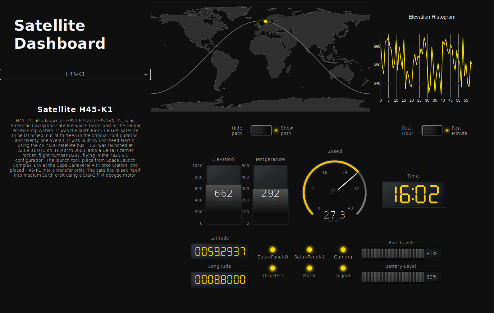

# Dash DAQ Satellite Dashboard

Dash abstracts away all of the technologies and protocols required to build an interactive web-based application, and
is a simple and effective way to bind a user interface around your Python code. To learn more about Dash, check out our
[documentation](https://dash.plot.ly/).

## About the app

A Dash application that tracks satellites and displays live data captured by them.

### Satellite

Artificial satellites are objects placed into orbit for various tasks, such as surveillance and transferring radio data
across the world. It's important to monitor satellites to ensure that they can accomplish their jobs, so information such as
their position and elevation are, for example, useful to determine whether or not a satellite is deviating from its original path
due to unforeseen circumstances.

### dash-daq

[Dash-DAQ](http://dash-daq.netlify.com/#about) is a data acquisition and control package built on top of Plotly's
[Dash](https://plot.ly/products/dash/). It comprises a robust set of controls that make it simpler to integrate data
acquisition and controls into your Dash applications.

## Getting Started

### Controls

- Satellite dropdown: Select which satellite to track.
- Histogram: Data is updated every 2 seconds, and to view the histogram for a desired data type, simply click on the
  corresponding Dash component.
- Path toggle: Show and hide the expected satellite path.
- Time toggle: Display data from the past hour or the past minute.

### Running the app locally

First create a virtual environment with conda or venv inside a temp folder, then activate it.

```
virtualenv venv

# Windows
venv\Scripts\activate
# Or Linux
source venv/bin/activate

```

Clone the git repo, then install the requirements with pip

```

git clone https://github.com/plotly/dash-sample-apps
cd dash-sample-apps/apps/dash-daq-satellite-dashboard
pip install -r requirements.txt

```

Run the app

```

python app.py

```

## Screenshots


