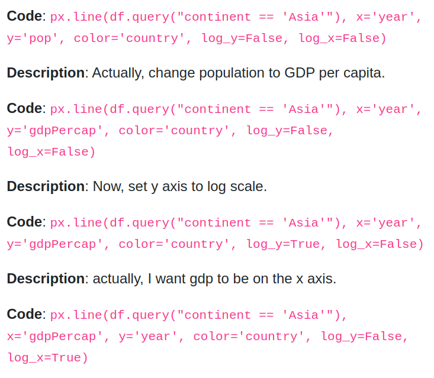

# Dash GPT-3 Line Charts Updater


[Try it now](https://dash-gallery.plotly.host/dash-gpt3-lines/)


This demos shows how to use GPT-3 to not only generate line charts using a given dataset (in this case, the [Gapminder dataset](https://plotly.com/python/plotly-express/)), but also update it in real time with only natural language queries:



It only took one Plotly Express code snippet (given in the card on the bottom left) for it to learn how to generate line charts.

For a smoother demo, [watch the video here](https://youtu.be/QMu7U5xFQBc).

## OpenAI GPT-3 API Access

In order to obtain access to the GPT-3 API, you will need to [join the waitlist](https://beta.openai.com/). Once you have the API,  you can find the secret key in [the quickstart](https://beta.openai.com/developer-quickstart), and export it as an environment variable:
```
export OPENAI_KEY="xxxxxxxxxxx"
```
Where "xxxxxxxxxxx" corresponds to your secret key.

## Instructions

To get started, first clone this repo:
```
git clone https://github.com/plotly/dash-sample-apps.git
cd dash-sample-apps/apps/dash-gpt3-bars
```

Create a conda env:
```
conda create -n dash-gpt3-bars python=3.7.6
conda activate dash-gpt3-bars
```

Or a venv (make sure your `python3` is 3.6+):
```
python3 -m venv venv
source venv/bin/activate  # for Windows, use venv\Scripts\activate.bat
```

Install all the requirements:

```
pip install -r requirements.txt
```

You can now run the app:
```
python app.py
```

and visit http://127.0.0.1:8050/.


## Discussions

If you are interested in chatting with us about the technical aspect of this, or would like to share the Dash apps you created with your own OpenAI API tokens, [join the discussion thread](https://community.plotly.com/t/automatically-generate-plotly-charts-using-gpt-3/42826).


## GPT-3 for Enterprises

If you are interested to use Dash and GPT-3 in an enterprise setting, please [reach out](https://plotly.com/contact-us/), and we'd be happy to discuss how we can help with [Dash Enterprise](https://plotly.com/dash/).